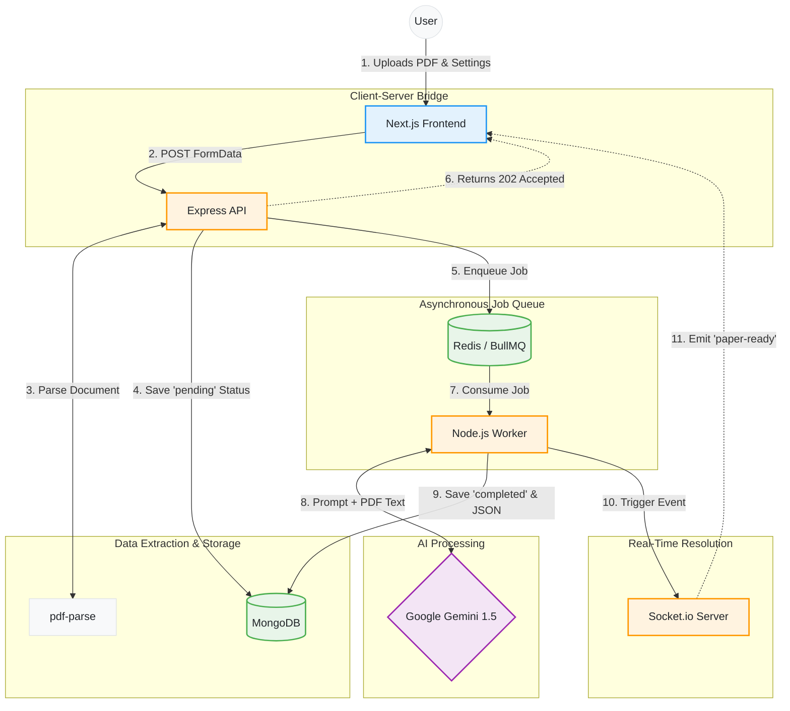

# 🧠 VedaAI: AI-Powered Assessment Creator


VedaAI is an intelligent, full-stack web application designed to empower educators by automatically generating highly specific, perfectly formatted exam papers and assignments. By leveraging Google's Gemini AI, VedaAI can instantly read uploaded syllabus PDFs and construct custom assessments based on strict teacher requirements.

---

## ✨ Core Features

- **📄 Context-Aware Generation:** Upload a syllabus or study guide (PDF), and the AI will strictly base all questions on the provided material.
- **⚙️ Granular Control:** Specify subject, grade level, question types (MCQ, Short Answer, Essay), and exact mark distributions.
- **⚡ Asynchronous Processing:** Heavy AI generation is offloaded to background workers using BullMQ and Redis, ensuring the server never freezes.
- **📡 Real-Time Updates:** WebSockets (Socket.io) provide seamless, real-time UI updates the exact millisecond the AI finishes generating the paper.
- **📊 Native JSON Output:** Strict prompt engineering forces the LLM to return native JSON, allowing for beautiful rendering on the frontend.

---

## 🏗️ Architecture Flow

VedaAI is built on a decoupled Client-Server architecture, optimized for long-running AI tasks. The following diagram illustrates the lifecycle of a single paper generation request.



---

## 🚀 Getting Started

Here is the step-by-step procedure to set up and run VedaAI locally.

### Prerequisites
Make sure you have the following installed on your machine:
- [Node.js](https://nodejs.org/en/) (v18+)
- [MongoDB](https://www.mongodb.com/) (Local or Atlas)
- [Redis](https://redis.io/) (Running locally or via Docker)

### 1. Clone the repository
```bash
git clone [https://github.com/your-username/veda-ai.git](https://github.com/your-username/veda-ai.git)
cd veda-ai
```

### 2. Setup the Backend
```bash
cd backend
npm install
```
Create a `.env` file in the `backend` directory:
```env
PORT=5000
MONGODB_URI=your_mongodb_connection_string
GEMINI_API_KEY=your_google_gemini_api_key
REDIS_HOST=127.0.0.1
REDIS_PORT=6379
```
Start the backend server and background workers:
```bash
npm run dev
```

### 3. Setup the Frontend
```bash
cd ../frontend
npm install
```
Create a `.env.local` file in the `frontend` directory:
```env
NEXT_PUBLIC_API_URL=http://localhost:5000
NEXT_PUBLIC_SOCKET_URL=http://localhost:5000
```
Start the Next.js development server:
```bash
npm run dev
```

Visit `http://localhost:3000` in your browser to start generating!

---

## 🔮 Future Implementations

The foundation of VedaAI is highly scalable. Planned upcoming features to evolve the platform into a full Learning Management System (LMS) include:

- **🎓 Role-Based Portals (LMS):** Dedicated dashboards for Teachers (to auto-grade and track assignment completion) and Students (to upload and manage their submissions).
- **🧠 "Knowledge Gap" Analytics:** Advanced AI analytics that alert teachers if a majority of the class struggles with a specific concept, providing actionable teaching insights.
- **🎥 Multi-Modal Content Ingestion:** Allowing teachers to generate quizzes directly from pasting YouTube video URLs or uploading audio lectures.
- **💡 Socratic Hint System:** An integrated AI tutor for the student portal that provides contextual, guiding hints to struggling students without giving away the final answers.
- **📝 Handwriting Recognition (OCR):** Upgrading the parser to support `.jpg` and `.png` uploads, allowing the AI to read and grade handwritten student math or essay submissions.
- **🏆 Gamification & Leaderboards:** Adding points for early submissions, learning streaks, and class leaderboards to boost student engagement.
- **🔐 Secure Authentication:** Implementing NextAuth (Auth.js) for secure account management, allowing educators to save, edit, and organize past exam papers.
## 🤝 Contributing

Contributions are highly welcome! Whether you are fixing bugs or adding new language features, here is how you can help:

1. **Report Bugs:** Open an issue if you encounter stack underflows or parsing errors.
2. **Suggest Features:** Propose optimizations or new syntax elements.
3. **Submit Code:** Fork the repository, ensure your code adheres to C++17 standards, add inline comments for complex logic, and submit a Pull Request.


---

## 📄 License

This project is provided as-is for educational, development, and learning purposes. Feel free to fork, modify, and experiment!

## 👨‍💻 Author
Developed by **Raj Kumar Singh**

If you have any questions or suggestions, feel free to open an issue or reach out!
